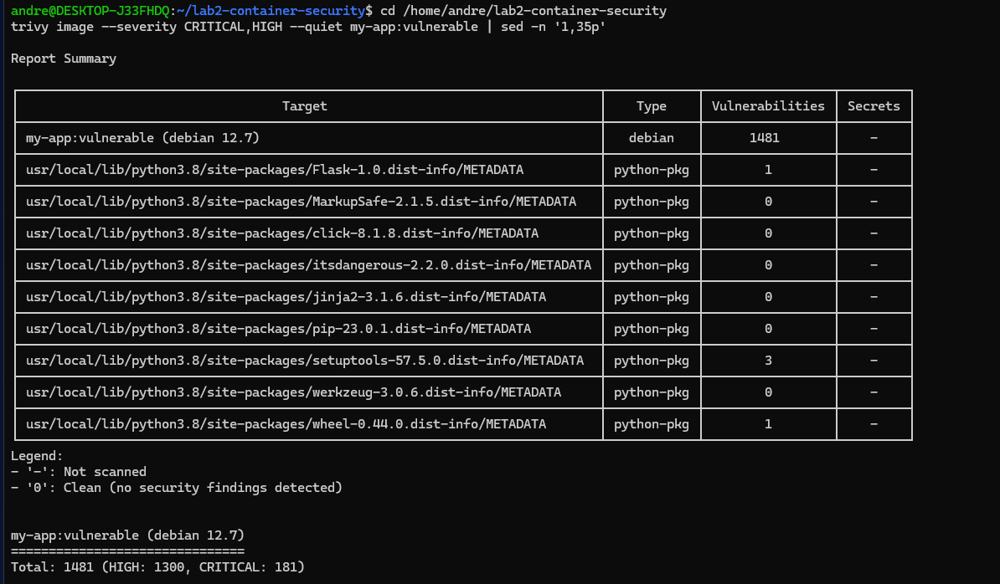
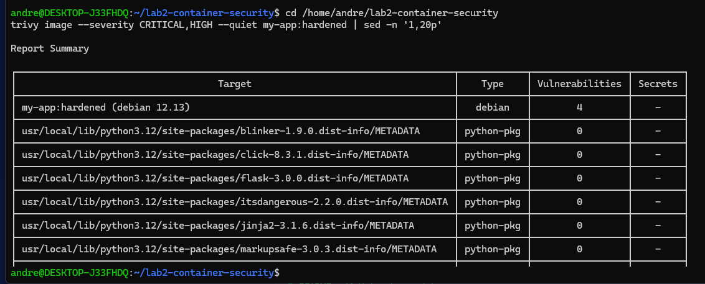
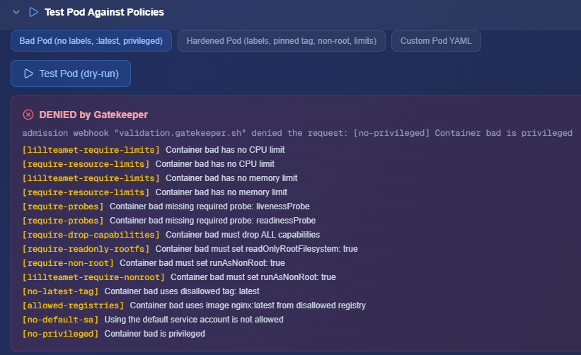
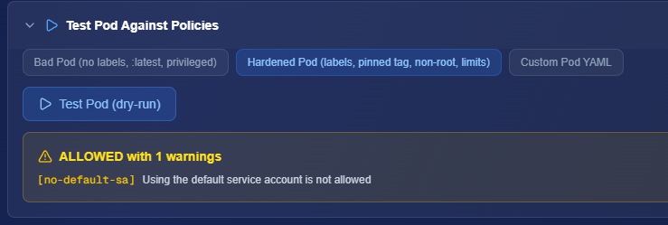

# Lab 2 - Container Security

## Översikt
Detta repo visar en sårbar container (`Dockerfile.vulnerable`) och en härdad container (`Dockerfile.hardened`), inklusive Trivy-skanning före/efter, SBOM i CycloneDX-format och Gatekeeper-policyfiler.

## Verktyg
- Docker
- Trivy
- OPA Gatekeeper (via Mission Control -> Lab Hub)

## Filer
- `Dockerfile.vulnerable`: medvetet sårbar image (`python:3.8`, `flask==1.0.0`)
- `Dockerfile.hardened`: härdad image (`python:3.12-slim-bookworm`, non-root user, healthcheck)
- `scan-before.txt`: Trivy-resultat för sårbar image
- `scan-after.txt`: Trivy-resultat för härdad image
- `sbom.json`: CycloneDX SBOM för härdad image
- `policies/*.yaml`: Gatekeeper policy template + constraint

## Vad som förändrades
- `python:3.8` -> `python:3.12-slim-bookworm`
- `flask==1.0.0` -> `flask==3.0.0`
- Non-root user (`appuser`)
- `pip --no-cache-dir`
- Healthcheck tillagd

## Trivy-resultat (CRITICAL/HIGH)
- Före: `Total: 1440 (HIGH: 1259, CRITICAL: 181)`
- Efter: `Total: 4 (HIGH: 2, CRITICAL: 2)`

## Screenshots
- 
- 
- 
- 

## Gatekeeper-status
Gatekeeper Lab i Mission Control användes enligt instruktion, men test/deploy är för närvarande blockerad av plattformens RBAC i labbmiljön (`forbidden` från servicekonto). Policyfilerna finns i `policies/` och är inkluderade för att visa implementation/förståelse.
